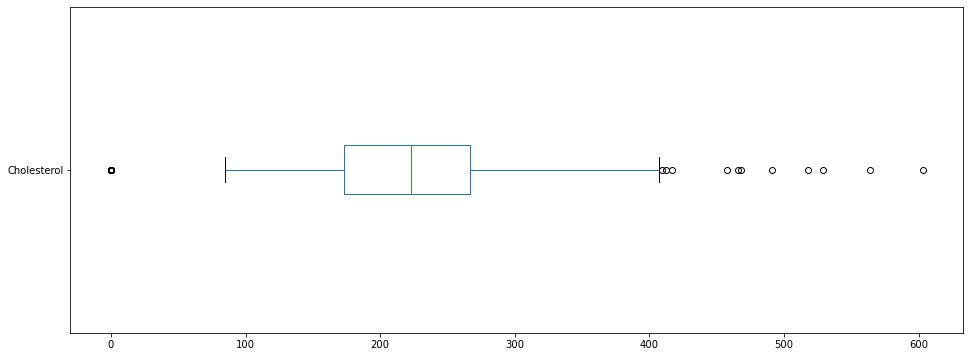
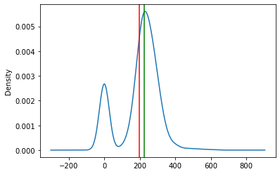
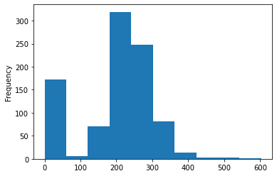
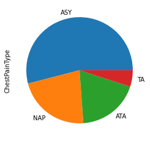
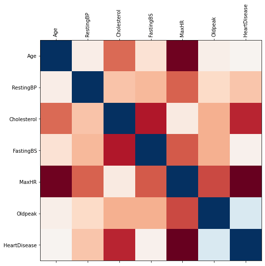
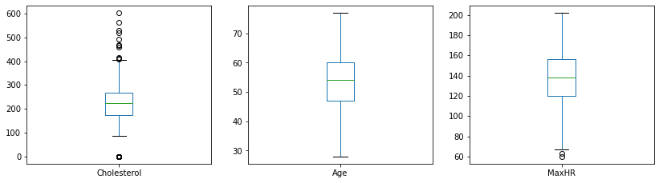
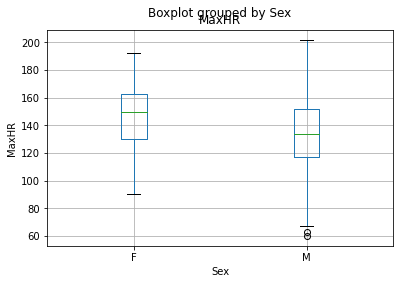

## YouTube Practice


```python
import numpy as np
import pandas as pd
import matplotlib.pyplot as plt

%matplotlib inline
```

## Loading Data


```python
data = pd.read_csv('heart.csv') #can include argument to parse dates parse_dates=['Dates']
data

```


<div>
<style scoped>
    .dataframe tbody tr th:only-of-type {
        vertical-align: middle;
    }

    .dataframe tbody tr th {
        vertical-align: top;
    }

    .dataframe thead th {
        text-align: right;
    }
</style>
<table border="1" class="dataframe">
  <thead>
    <tr style="text-align: right;">
      <th></th>
      <th>Age</th>
      <th>Sex</th>
      <th>ChestPainType</th>
      <th>RestingBP</th>
      <th>Cholesterol</th>
      <th>FastingBS</th>
      <th>RestingECG</th>
      <th>MaxHR</th>
      <th>ExerciseAngina</th>
      <th>Oldpeak</th>
      <th>ST_Slope</th>
      <th>HeartDisease</th>
    </tr>
  </thead>
  <tbody>
    <tr>
      <th>0</th>
      <td>40</td>
      <td>M</td>
      <td>ATA</td>
      <td>140</td>
      <td>289</td>
      <td>0</td>
      <td>Normal</td>
      <td>172</td>
      <td>N</td>
      <td>0.0</td>
      <td>Up</td>
      <td>0</td>
    </tr>
    <tr>
      <th>1</th>
      <td>49</td>
      <td>F</td>
      <td>NAP</td>
      <td>160</td>
      <td>180</td>
      <td>0</td>
      <td>Normal</td>
      <td>156</td>
      <td>N</td>
      <td>1.0</td>
      <td>Flat</td>
      <td>1</td>
    </tr>
    <tr>
      <th>2</th>
      <td>37</td>
      <td>M</td>
      <td>ATA</td>
      <td>130</td>
      <td>283</td>
      <td>0</td>
      <td>ST</td>
      <td>98</td>
      <td>N</td>
      <td>0.0</td>
      <td>Up</td>
      <td>0</td>
    </tr>
    <tr>
      <th>3</th>
      <td>48</td>
      <td>F</td>
      <td>ASY</td>
      <td>138</td>
      <td>214</td>
      <td>0</td>
      <td>Normal</td>
      <td>108</td>
      <td>Y</td>
      <td>1.5</td>
      <td>Flat</td>
      <td>1</td>
    </tr>
    <tr>
      <th>4</th>
      <td>54</td>
      <td>M</td>
      <td>NAP</td>
      <td>150</td>
      <td>195</td>
      <td>0</td>
      <td>Normal</td>
      <td>122</td>
      <td>N</td>
      <td>0.0</td>
      <td>Up</td>
      <td>0</td>
    </tr>
    <tr>
      <th>...</th>
      <td>...</td>
      <td>...</td>
      <td>...</td>
      <td>...</td>
      <td>...</td>
      <td>...</td>
      <td>...</td>
      <td>...</td>
      <td>...</td>
      <td>...</td>
      <td>...</td>
      <td>...</td>
    </tr>
    <tr>
      <th>913</th>
      <td>45</td>
      <td>M</td>
      <td>TA</td>
      <td>110</td>
      <td>264</td>
      <td>0</td>
      <td>Normal</td>
      <td>132</td>
      <td>N</td>
      <td>1.2</td>
      <td>Flat</td>
      <td>1</td>
    </tr>
    <tr>
      <th>914</th>
      <td>68</td>
      <td>M</td>
      <td>ASY</td>
      <td>144</td>
      <td>193</td>
      <td>1</td>
      <td>Normal</td>
      <td>141</td>
      <td>N</td>
      <td>3.4</td>
      <td>Flat</td>
      <td>1</td>
    </tr>
    <tr>
      <th>915</th>
      <td>57</td>
      <td>M</td>
      <td>ASY</td>
      <td>130</td>
      <td>131</td>
      <td>0</td>
      <td>Normal</td>
      <td>115</td>
      <td>Y</td>
      <td>1.2</td>
      <td>Flat</td>
      <td>1</td>
    </tr>
    <tr>
      <th>916</th>
      <td>57</td>
      <td>F</td>
      <td>ATA</td>
      <td>130</td>
      <td>236</td>
      <td>0</td>
      <td>LVH</td>
      <td>174</td>
      <td>N</td>
      <td>0.0</td>
      <td>Flat</td>
      <td>1</td>
    </tr>
    <tr>
      <th>917</th>
      <td>38</td>
      <td>M</td>
      <td>NAP</td>
      <td>138</td>
      <td>175</td>
      <td>0</td>
      <td>Normal</td>
      <td>173</td>
      <td>N</td>
      <td>0.0</td>
      <td>Up</td>
      <td>0</td>
    </tr>
  </tbody>
</table>
<p>918 rows × 12 columns</p>
</div>


```python
data.head()
```


<div>
<style scoped>
    .dataframe tbody tr th:only-of-type {
        vertical-align: middle;
    }

    .dataframe tbody tr th {
        vertical-align: top;
    }

    .dataframe thead th {
        text-align: right;
    }
</style>
<table border="1" class="dataframe">
  <thead>
    <tr style="text-align: right;">
      <th></th>
      <th>Age</th>
      <th>Sex</th>
      <th>ChestPainType</th>
      <th>RestingBP</th>
      <th>Cholesterol</th>
      <th>FastingBS</th>
      <th>RestingECG</th>
      <th>MaxHR</th>
      <th>ExerciseAngina</th>
      <th>Oldpeak</th>
      <th>ST_Slope</th>
      <th>HeartDisease</th>
    </tr>
  </thead>
  <tbody>
    <tr>
      <th>0</th>
      <td>40</td>
      <td>M</td>
      <td>ATA</td>
      <td>140</td>
      <td>289</td>
      <td>0</td>
      <td>Normal</td>
      <td>172</td>
      <td>N</td>
      <td>0.0</td>
      <td>Up</td>
      <td>0</td>
    </tr>
    <tr>
      <th>1</th>
      <td>49</td>
      <td>F</td>
      <td>NAP</td>
      <td>160</td>
      <td>180</td>
      <td>0</td>
      <td>Normal</td>
      <td>156</td>
      <td>N</td>
      <td>1.0</td>
      <td>Flat</td>
      <td>1</td>
    </tr>
    <tr>
      <th>2</th>
      <td>37</td>
      <td>M</td>
      <td>ATA</td>
      <td>130</td>
      <td>283</td>
      <td>0</td>
      <td>ST</td>
      <td>98</td>
      <td>N</td>
      <td>0.0</td>
      <td>Up</td>
      <td>0</td>
    </tr>
    <tr>
      <th>3</th>
      <td>48</td>
      <td>F</td>
      <td>ASY</td>
      <td>138</td>
      <td>214</td>
      <td>0</td>
      <td>Normal</td>
      <td>108</td>
      <td>Y</td>
      <td>1.5</td>
      <td>Flat</td>
      <td>1</td>
    </tr>
    <tr>
      <th>4</th>
      <td>54</td>
      <td>M</td>
      <td>NAP</td>
      <td>150</td>
      <td>195</td>
      <td>0</td>
      <td>Normal</td>
      <td>122</td>
      <td>N</td>
      <td>0.0</td>
      <td>Up</td>
      <td>0</td>
    </tr>
  </tbody>
</table>
</div>


```python
data.shape
```


    (918, 12)


```python
data.info()    #similar to structure
```

    <class 'pandas.core.frame.DataFrame'>
    RangeIndex: 918 entries, 0 to 917
    Data columns (total 12 columns):
     #   Column          Non-Null Count  Dtype  
    ---  ------          --------------  -----  
     0   Age             918 non-null    int64  
     1   Sex             918 non-null    object 
     2   ChestPainType   918 non-null    object 
     3   RestingBP       918 non-null    int64  
     4   Cholesterol     918 non-null    int64  
     5   FastingBS       918 non-null    int64  
     6   RestingECG      918 non-null    object 
     7   MaxHR           918 non-null    int64  
     8   ExerciseAngina  918 non-null    object 
     9   Oldpeak         918 non-null    float64
     10  ST_Slope        918 non-null    object 
     11  HeartDisease    918 non-null    int64  
    dtypes: float64(1), int64(6), object(5)
    memory usage: 86.2+ KB


```python
data.describe()     #similar summary
```


<div>
<style scoped>
    .dataframe tbody tr th:only-of-type {
        vertical-align: middle;
    }

    .dataframe tbody tr th {
        vertical-align: top;
    }

    .dataframe thead th {
        text-align: right;
    }
</style>
<table border="1" class="dataframe">
  <thead>
    <tr style="text-align: right;">
      <th></th>
      <th>Age</th>
      <th>RestingBP</th>
      <th>Cholesterol</th>
      <th>FastingBS</th>
      <th>MaxHR</th>
      <th>Oldpeak</th>
      <th>HeartDisease</th>
    </tr>
  </thead>
  <tbody>
    <tr>
      <th>count</th>
      <td>918.000000</td>
      <td>918.000000</td>
      <td>918.000000</td>
      <td>918.000000</td>
      <td>918.000000</td>
      <td>918.000000</td>
      <td>918.000000</td>
    </tr>
    <tr>
      <th>mean</th>
      <td>53.510893</td>
      <td>132.396514</td>
      <td>198.799564</td>
      <td>0.233115</td>
      <td>136.809368</td>
      <td>0.887364</td>
      <td>0.553377</td>
    </tr>
    <tr>
      <th>std</th>
      <td>9.432617</td>
      <td>18.514154</td>
      <td>109.384145</td>
      <td>0.423046</td>
      <td>25.460334</td>
      <td>1.066570</td>
      <td>0.497414</td>
    </tr>
    <tr>
      <th>min</th>
      <td>28.000000</td>
      <td>0.000000</td>
      <td>0.000000</td>
      <td>0.000000</td>
      <td>60.000000</td>
      <td>-2.600000</td>
      <td>0.000000</td>
    </tr>
    <tr>
      <th>25%</th>
      <td>47.000000</td>
      <td>120.000000</td>
      <td>173.250000</td>
      <td>0.000000</td>
      <td>120.000000</td>
      <td>0.000000</td>
      <td>0.000000</td>
    </tr>
    <tr>
      <th>50%</th>
      <td>54.000000</td>
      <td>130.000000</td>
      <td>223.000000</td>
      <td>0.000000</td>
      <td>138.000000</td>
      <td>0.600000</td>
      <td>1.000000</td>
    </tr>
    <tr>
      <th>75%</th>
      <td>60.000000</td>
      <td>140.000000</td>
      <td>267.000000</td>
      <td>0.000000</td>
      <td>156.000000</td>
      <td>1.500000</td>
      <td>1.000000</td>
    </tr>
    <tr>
      <th>max</th>
      <td>77.000000</td>
      <td>200.000000</td>
      <td>603.000000</td>
      <td>1.000000</td>
      <td>202.000000</td>
      <td>6.200000</td>
      <td>1.000000</td>
    </tr>
  </tbody>
</table>
</div>


```python
data['Cholesterol'].describe()
```


    count    918.000000
    mean     198.799564
    std      109.384145
    min        0.000000
    25%      173.250000
    50%      223.000000
    75%      267.000000
    max      603.000000
    Name: Cholesterol, dtype: float64


```python
data['Cholesterol'].mean()
```


    198.7995642701525


```python
data['Cholesterol'].plot(kind='box', vert=False, figsize=(16,6));
```


    

    


```python
ax = data['Cholesterol'].plot(kind='density')
ax.axvline(data['Cholesterol'].mean(), color='red')
ax.axvline(data['Cholesterol'].median(), color='green');
```


    

    


```python
ax = data['Cholesterol'].plot(kind='hist')
```


    

    


```python
data.head()
```


<div>
<style scoped>
    .dataframe tbody tr th:only-of-type {
        vertical-align: middle;
    }

    .dataframe tbody tr th {
        vertical-align: top;
    }

    .dataframe thead th {
        text-align: right;
    }
</style>
<table border="1" class="dataframe">
  <thead>
    <tr style="text-align: right;">
      <th></th>
      <th>Age</th>
      <th>Sex</th>
      <th>ChestPainType</th>
      <th>RestingBP</th>
      <th>Cholesterol</th>
      <th>FastingBS</th>
      <th>RestingECG</th>
      <th>MaxHR</th>
      <th>ExerciseAngina</th>
      <th>Oldpeak</th>
      <th>ST_Slope</th>
      <th>HeartDisease</th>
    </tr>
  </thead>
  <tbody>
    <tr>
      <th>0</th>
      <td>40</td>
      <td>M</td>
      <td>ATA</td>
      <td>140</td>
      <td>289</td>
      <td>0</td>
      <td>Normal</td>
      <td>172</td>
      <td>N</td>
      <td>0.0</td>
      <td>Up</td>
      <td>0</td>
    </tr>
    <tr>
      <th>1</th>
      <td>49</td>
      <td>F</td>
      <td>NAP</td>
      <td>160</td>
      <td>180</td>
      <td>0</td>
      <td>Normal</td>
      <td>156</td>
      <td>N</td>
      <td>1.0</td>
      <td>Flat</td>
      <td>1</td>
    </tr>
    <tr>
      <th>2</th>
      <td>37</td>
      <td>M</td>
      <td>ATA</td>
      <td>130</td>
      <td>283</td>
      <td>0</td>
      <td>ST</td>
      <td>98</td>
      <td>N</td>
      <td>0.0</td>
      <td>Up</td>
      <td>0</td>
    </tr>
    <tr>
      <th>3</th>
      <td>48</td>
      <td>F</td>
      <td>ASY</td>
      <td>138</td>
      <td>214</td>
      <td>0</td>
      <td>Normal</td>
      <td>108</td>
      <td>Y</td>
      <td>1.5</td>
      <td>Flat</td>
      <td>1</td>
    </tr>
    <tr>
      <th>4</th>
      <td>54</td>
      <td>M</td>
      <td>NAP</td>
      <td>150</td>
      <td>195</td>
      <td>0</td>
      <td>Normal</td>
      <td>122</td>
      <td>N</td>
      <td>0.0</td>
      <td>Up</td>
      <td>0</td>
    </tr>
  </tbody>
</table>
</div>


```python
data['Sex'].value_counts()
```


    M    725
    F    193
    Name: Sex, dtype: int64


```python
data['ChestPainType'].value_counts().plot(kind='pie');
```


    

    


```python
corr=data.corr()         #doesn't include non-numeric automatically
corr
```


<div>
<style scoped>
    .dataframe tbody tr th:only-of-type {
        vertical-align: middle;
    }

    .dataframe tbody tr th {
        vertical-align: top;
    }

    .dataframe thead th {
        text-align: right;
    }
</style>
<table border="1" class="dataframe">
  <thead>
    <tr style="text-align: right;">
      <th></th>
      <th>Age</th>
      <th>RestingBP</th>
      <th>Cholesterol</th>
      <th>FastingBS</th>
      <th>MaxHR</th>
      <th>Oldpeak</th>
      <th>HeartDisease</th>
    </tr>
  </thead>
  <tbody>
    <tr>
      <th>Age</th>
      <td>1.000000</td>
      <td>0.254399</td>
      <td>-0.095282</td>
      <td>0.198039</td>
      <td>-0.382045</td>
      <td>0.258612</td>
      <td>0.282039</td>
    </tr>
    <tr>
      <th>RestingBP</th>
      <td>0.254399</td>
      <td>1.000000</td>
      <td>0.100893</td>
      <td>0.070193</td>
      <td>-0.112135</td>
      <td>0.164803</td>
      <td>0.107589</td>
    </tr>
    <tr>
      <th>Cholesterol</th>
      <td>-0.095282</td>
      <td>0.100893</td>
      <td>1.000000</td>
      <td>-0.260974</td>
      <td>0.235792</td>
      <td>0.050148</td>
      <td>-0.232741</td>
    </tr>
    <tr>
      <th>FastingBS</th>
      <td>0.198039</td>
      <td>0.070193</td>
      <td>-0.260974</td>
      <td>1.000000</td>
      <td>-0.131438</td>
      <td>0.052698</td>
      <td>0.267291</td>
    </tr>
    <tr>
      <th>MaxHR</th>
      <td>-0.382045</td>
      <td>-0.112135</td>
      <td>0.235792</td>
      <td>-0.131438</td>
      <td>1.000000</td>
      <td>-0.160691</td>
      <td>-0.400421</td>
    </tr>
    <tr>
      <th>Oldpeak</th>
      <td>0.258612</td>
      <td>0.164803</td>
      <td>0.050148</td>
      <td>0.052698</td>
      <td>-0.160691</td>
      <td>1.000000</td>
      <td>0.403951</td>
    </tr>
    <tr>
      <th>HeartDisease</th>
      <td>0.282039</td>
      <td>0.107589</td>
      <td>-0.232741</td>
      <td>0.267291</td>
      <td>-0.400421</td>
      <td>0.403951</td>
      <td>1.000000</td>
    </tr>
  </tbody>
</table>
</div>


```python
fig = plt.figure(figsize=(8,8))
plt.matshow(corr, cmap='RdBu', fignum=fig.number)
plt.xticks(range(len(corr.columns)), corr.columns, rotation='vertical');
plt.yticks(range(len(corr.columns)), corr.columns);
```


    

    


```python
data.plot(kind='scatter', x='Age', y='MaxHR');
```


    

    


```python
boxplot_cols = ['Cholesterol','Age','MaxHR']
data[boxplot_cols].plot(kind='box', subplots=True, layout=(2,3), figsize=(14,8));
```


    

    


```python
ax = data[['MaxHR', 'Sex']].boxplot(by='Sex')
ax.set_ylabel('MaxHR')
ax.set_xlabel('Sex');
```


    

    


```python

```
